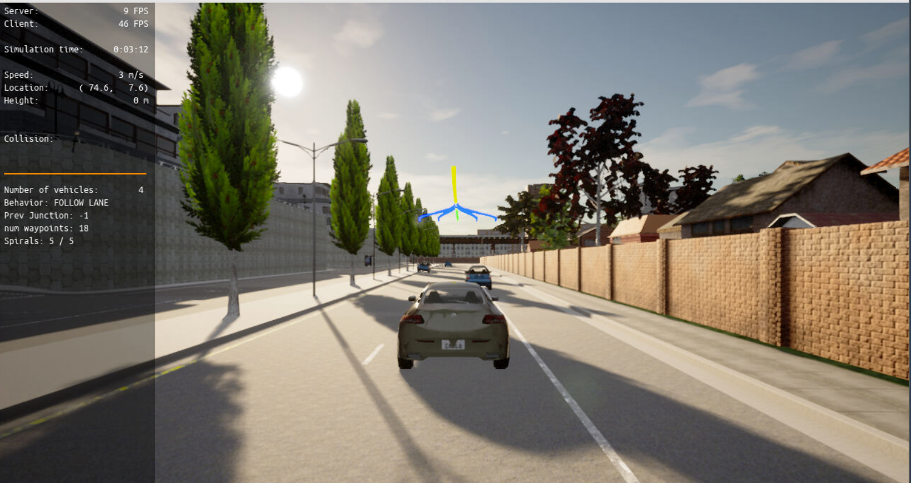
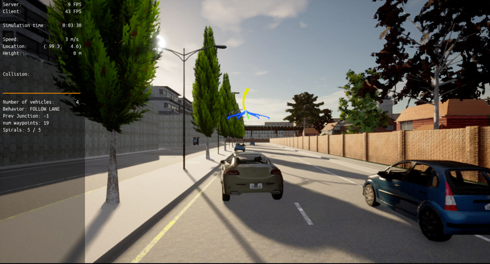
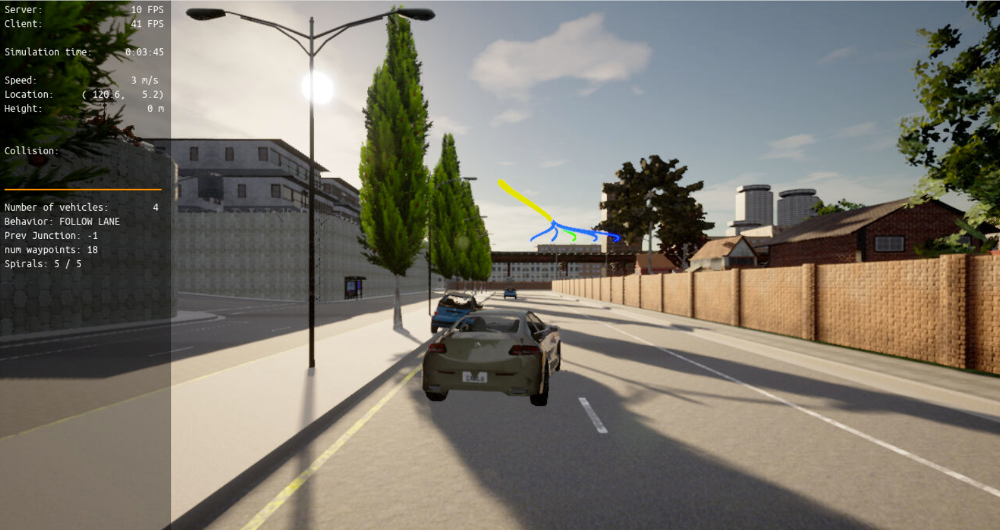
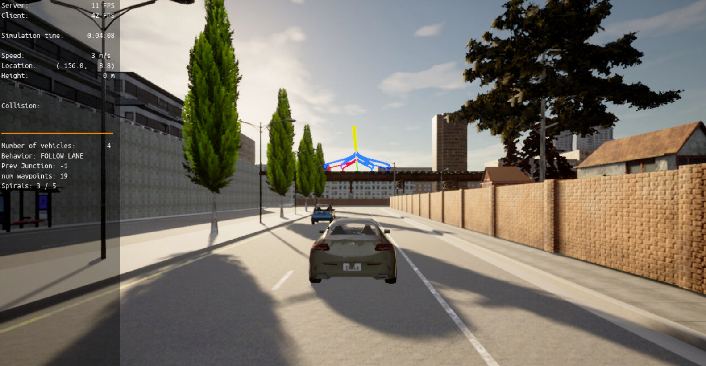
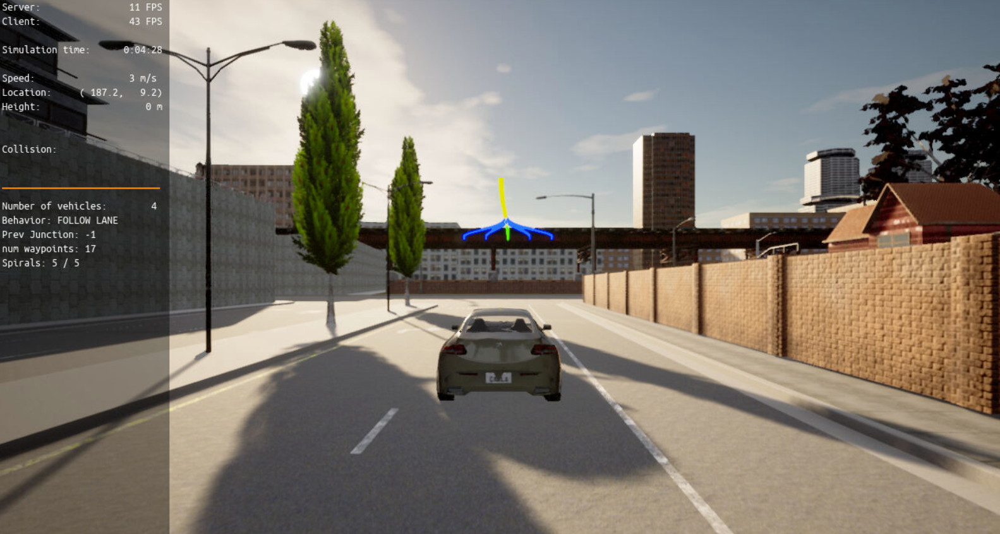

# Motion Planning and Decision Making for Autonomous Vehicles

In this project, two of the main components of a traditional hierarchical planner: The Behavior Planner and the Motion Planner are implemented.

These planners will provide following capabilities.
* Avoid static objects parked on the side of the road. 
* Handle any type of intersection by STOPPING in all of them 
* Track the centerline on the traveling lane.

Following are few of the screenshots while the planner in action within the Carla Simulator
## At the start, following the lane 

## After passing the blue car on the right, taking the centre lane

# Avoiding the blue car parked on the left kerb by taking a rightward path

# Following the centre path while avoiding the car parked on the left side of the road

# Move straight in the centre path when no obstacles seen ahead

